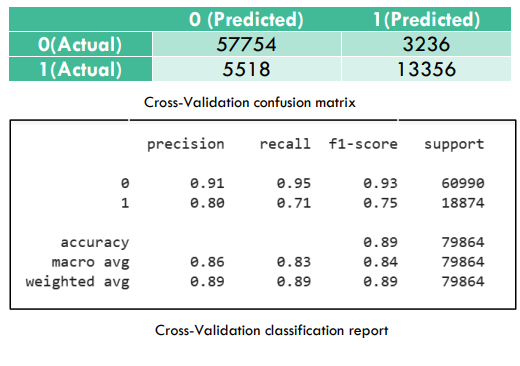
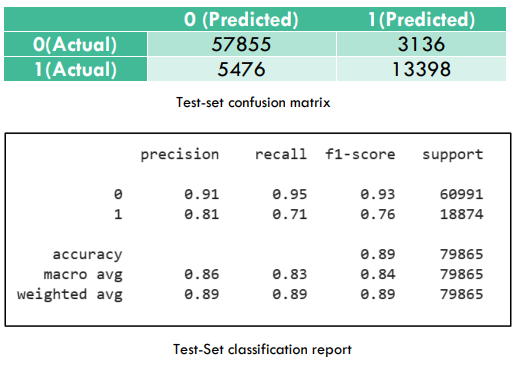

# Loan-Deafult-Prediction
Use of Deep Neural Networks to predict whether a borrower is going to default on loan or not.
Banks earn a major part of their revenue by lending loans. But, with lending comes a great financial risk due to the possibility of borrower defaulting on loan. The traditional methods of mitigating this issue involved setting up a panel of experts who would analyze the data concerning applicant’s employment records, annual income, interest rate, credit history, etc. However, with the increase in computational power and the recent advancements in machine learning, it has been a topic of interest whether ML algorithms can perform better classification. Our aim is to analyze a dataset pertaining to loan borrowers in the past and build a strong ML model to classify if any borrower is likely to default or not. 

The following is an outline describing the files.
DataCleaning.ipynb - Notebook containing a detailed description of how the data was cleaned.

Processed_Data.zip - The zip folder containing the csv file of datra obtained after processing

model_history.csv - History of model training for 121 epochs

Step1_History.csv - History of model training for the first 120 epochs

ModelTraining.ipynb - used for model training

Project_Report.pdf - Project report

Model_params.zip - Zip folder containing the model weights and biases in HDF5 format. 

link to original dataset: https://www.kaggle.com/datasets/gauravduttakiit/bank-fears-loanliness?select=train_indessa.csv
The same has been provided in the project report as well.

### Results

After data-preprocessing, feature-selection, and hyper-parametertuning, the final model resulted in the following results:

* The cross-validation set was used for hyperparameter 
tuning and continuously tracking the performance of the 
network on unseen data. The cross-validation accuracy 
was found to be 89.04% whereas the F1-score was 
found to be 0.75 for the positive defaulter class which is 
very important since predicting a defaulter as a nondefaulter (Type2 error) is a greater risk for the bank 
than missed loan (Type1 error).

* The accuracy over test-set was found to be 89.22%. The 
model yielded satisfactory results over both seen and 
unseen data.
